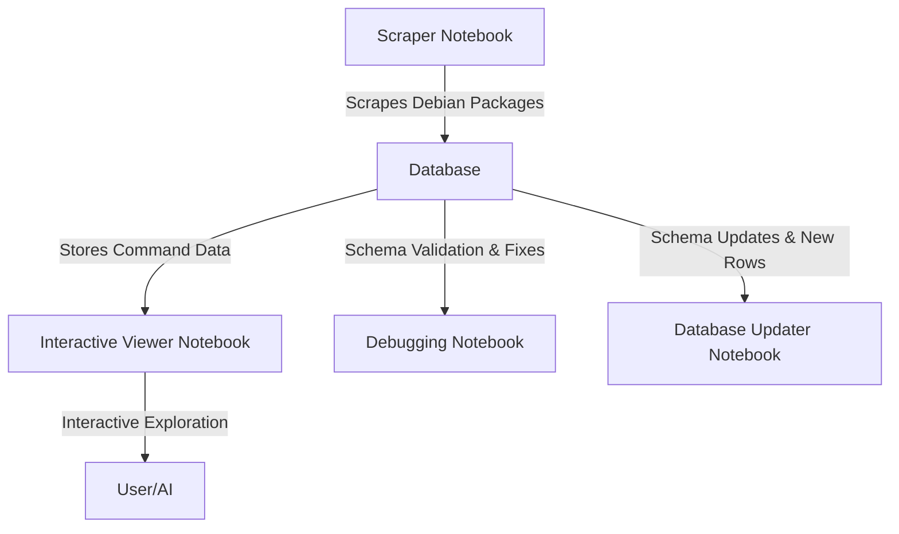

# 🚀 Debian Command Center System Documentation

## 📖 Overview
The **Debian Command Center** is a system designed to scrape, store, and interactively explore Debian command packages. The system is composed of multiple notebooks, each with a specific role, and a centralized SQLite database that stores information about the commands. 

This system is designed to:
- Scrape and store Debian package information.
- Provide an interactive viewer for exploring and validating the data.
- Debug and update the database schema and contents as needed.
- Offer tools to onboard new users or AI systems seamlessly.

---

## 🗂️ System Structure

### 1. **Scraper Notebook**
- **Purpose**: Scrapes Debian package information and populates the SQLite database.
- **Key Features**:
  - Fetches package names, versions, descriptions, and debports from Debian's experimental package list.
  - Dynamically adds missing columns (e.g., `manpage_url`) to the database.
  - Ensures data integrity by skipping duplicate entries.

### 2. **Interactive Viewer Notebook**
- **Purpose**: Provides a user-friendly interface to explore the database.
- **Key Features**:
  - Displays paginated data with clickable command names.
  - Links commands to their manpages (or placeholder URLs if manpages are missing).
  - Allows navigation through the database using interactive widgets.

### 3. **Database Updater Notebook**
- **Purpose**: Updates the database schema and contents.
- **Key Features**:
  - Adds new columns to the database.
  - Inserts or updates rows programmatically.
  - Creates backups of the database before making changes.

### 4. **Debugging Notebook**
- **Purpose**: Diagnoses and resolves issues in the system.
- **Key Features**:
  - Validates the database schema and data integrity.
  - Identifies and fixes null or missing values.
  - Logs all detected issues and suggests fixes.

---

## 📂 Database Schema

The system uses an SQLite database named `debian_commands.db`. The main table is `commands`, with the following schema:

| Column Name   | Data Type | Description                                           |
|---------------|-----------|-------------------------------------------------------|
| `name`        | TEXT      | Name of the command.                                  |
| `version`     | TEXT      | Version of the command.                               |
| `description` | TEXT      | Brief description of the command.                    |
| `debports`    | TEXT      | Debian ports or architectures for the command.       |
| `manpage_url` | TEXT      | URL to the command's manpage (or placeholder URL).    |
| `date_created`| TEXT      | Timestamp when the row was created.                  |
| `last_updated`| TEXT      | Timestamp when the row was last updated.             |

---

## 🔄 Workflow Diagram

---

## 🛠️ Common Use Cases

### 1. **Scrape New Data**
- Use the **Scraper Notebook** to fetch and store Debian package information in the database.
- Ensures all necessary columns are present and skips duplicates.

### 2. **Explore the Database**
- Use the **Interactive Viewer Notebook** to browse the database.
- Click on command names to view their manpages or placeholder URLs.

### 3. **Update the Database**
- Use the **Database Updater Notebook** to:
  - Add new columns (e.g., for additional metadata).
  - Insert or update rows programmatically.
  - Back up the database before making changes.

### 4. **Debug Issues**
- Use the **Debugging Notebook** to:
  - Check for missing columns or null values.
  - Identify and resolve data integrity issues.
  - Validate schema and suggest fixes.

---

## ⚠️ Error Handling

### 1. **Missing Columns**
- Automatically adds missing columns using the `ALTER TABLE` command.

### 2. **Null or Missing Values**
- Populates null or empty `manpage_url` values with a placeholder URL.

### 3. **Duplicate Entries**
- Skips duplicate entries during data insertion.

### 4. **Database Backup**
- Automatically creates a backup before making significant schema or data changes.

---

## 🌟 Future Improvements

1. **Enhanced Scraper**:
   - Add support for scraping additional metadata (e.g., package dependencies).

2. **Advanced Viewer**:
   - Include search and filter options for easier data exploration.

3. **API Integration**:
   - Expose the database as a REST API for integration with other tools.

4. **Automated Testing**:
   - Add automated tests to validate the functionality of all notebooks.

5. **Extended Debugging**:
   - Include validation for data formats (e.g., timestamps, URLs).

---

## 🤝 Onboarding New Users or AI Systems

### For New Users:
1. Read this documentation to understand the system.
2. Start with the **Interactive Viewer Notebook** to familiarize yourself with the database.
3. Use the **Scraper Notebook** to fetch new data.

### For AI Systems:
1. Use this documentation to learn the database schema and workflows.
2. Leverage the **Database Updater Notebook** to programmatically modify the database.
3. Use the **Debugging Notebook** to validate the system's integrity before making changes.

---

## 🚀 Conclusion

This documentation provides a comprehensive overview of the Debian Command Center system. By following the workflows and use cases outlined here, you can effectively manage and explore the database while ensuring its integrity and scalability.
